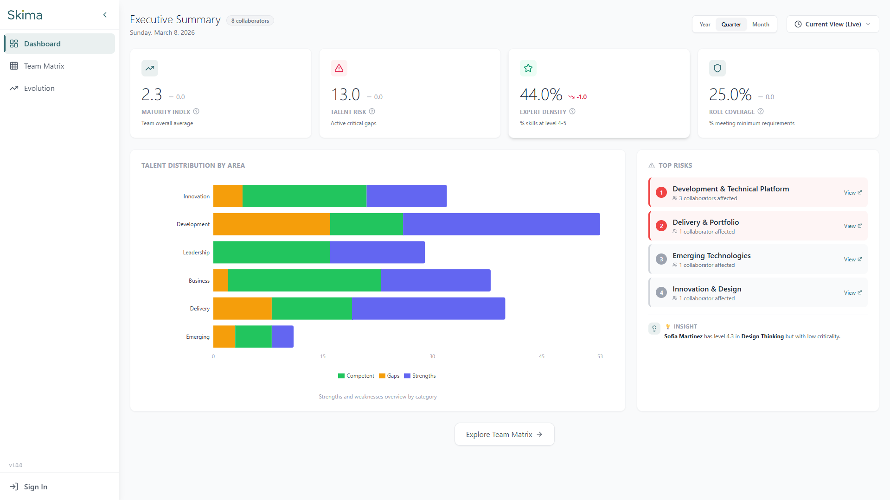
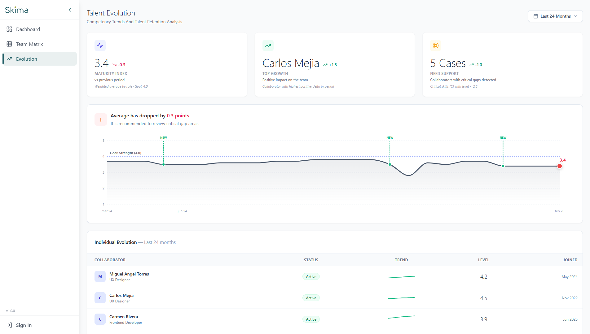
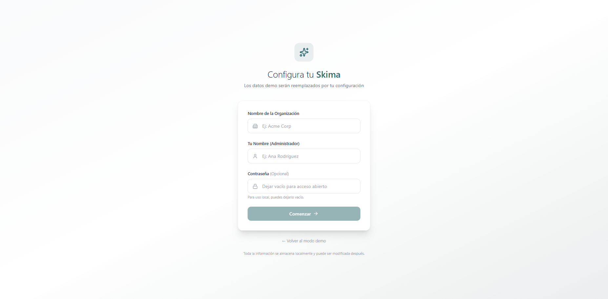

<p align="center">
  
</p>

<p align="center">
  A local-first talent intelligence platform for tracking team competencies.<br/>
  No account, no cloud, no tracking — all data stays on your device.
</p>

<p align="center">
  <a href="#installation">Install</a> &nbsp;&middot;&nbsp;
  <a href="#features">Features</a> &nbsp;&middot;&nbsp;
  <a href="#screenshots">Screenshots</a> &nbsp;&middot;&nbsp;
  <a href="#tech-stack">Tech Stack</a>
</p>

<p align="center">
  
</p>

## Features

- **Executive Dashboard** — KPIs, gap analysis, and trend tracking at a glance
- **Team Skills Matrix** — transposed heatmap view showing strengths and gaps across the team
- **Collaborator Profiles** — individual evolution sparklines and skill breakdowns
- **Evaluation System** — weighted formula (level x frequency x criticality) for objective scoring
- **Role Profiles** — define expected competencies per role and track alignment
- **Time Travel** — compare team state across quarters, semesters, and years
- **Demo Mode** — explore with rich sample data before configuring your own
- **Export / Import** — move data in and out as needed
- **Cross-platform Desktop** — Windows, macOS, and Linux via Tauri 2
- **Offline-first** — works 100% offline, all data stored locally in SQLite

---

## Screenshots

<p align="center">
  
</p>
<p align="center"><sub>Executive Dashboard — KPIs, gap analysis, and trend tracking at a glance</sub></p>

<br/>

<p align="center">
  
</p>
<p align="center"><sub>Team Skills Matrix — Transposed heatmap showing strengths and gaps</sub></p>

<br/>

<p align="center">
  
</p>
<p align="center"><sub>Evolution — Track team progress over time</sub></p>

<br/>

<p align="center">
  
</p>
<p align="center"><sub>Setup — Get started with demo data or configure your own space</sub></p>

---

## Installation

Skima runs entirely on your device — no account, no cloud, no tracking.

- **[Desktop app](#desktop-app)** (Windows, macOS, Linux) — Download from GitHub Releases
- **[Docker](#docker)** — Self-hosted via `docker compose`
- **[From source](#from-source)** — Clone and build

### Desktop App

Download the latest release for your platform from [GitHub Releases](https://github.com/henfrydls/skills-dashboard/releases):

| Platform | Format |
|----------|--------|
| Windows | `.exe` installer |
| macOS | `.dmg` disk image |
| Linux | `.deb` / `.AppImage` |

Just install and open — no setup, no accounts, no internet required.

### Docker

Run Skima as a local web service with a single command. Requires [Docker](https://docs.docker.com/get-docker/).

```bash
docker compose up -d
```

Open `http://localhost:3000` in your browser. Data persists in a Docker volume.

### From Source

Requires [Node.js](https://nodejs.org/) 20+.

```bash
git clone https://github.com/henfrydls/skills-dashboard.git
cd skills-dashboard
npm install
npm run dev
```

Open `http://localhost:5173` in your browser. The API runs at `http://localhost:3001`.

To build the desktop app from source, you also need [Rust](https://www.rust-lang.org/tools/install):

```bash
npm run tauri:build
```

---

<details>
<summary><strong>Development and Testing</strong></summary>

### Commands

```bash
npm install              # Install all dependencies (root + client + server)
npm run dev              # Start client (5173) + server (3001) concurrently
npm run dev:client       # Frontend only
npm run dev:server       # Backend only
npm run build            # Production build (client + server)
npm run tauri:build      # Build desktop installer (requires Rust)
```

### Database

```bash
npm run db:migrate       # Run Prisma migrations
npm run db:push          # Sync schema without migration
npm run db:seed          # Load demo data
```

### Testing

```bash
npm test                 # All tests (729 tests, 80%+ coverage)
npm run test:client      # React component and logic tests (668 tests)
npm run test:server      # API and middleware tests (61 tests)
npm run test:coverage    # Full coverage report (client + server)
```

### Project Structure

```
client/src/
  components/
    auth/                # LoginModal, ProtectedRoute
    common/              # Button, Card, Badge, StatCard, etc.
    dashboard/           # ExecutiveKPIGrid, DashboardHeader, StrategicInsights
    evolution/           # EvolutionChart, EvolutionList
    layout/              # Layout, Sidebar
    matrix/              # TransposedMatrixTable, CollaboratorList
    settings/            # CategoriesTab, CollaboratorsTab, SkillsTab
  contexts/              # AuthContext, ConfigContext
  hooks/                 # useEvolutionData
  lib/                   # dashboardLogic, skillsLogic, evolutionLogic
  pages/                 # DashboardView, TeamMatrixPage, EvolutionPage
  App.jsx

server/src/
  routes/                # auth.js, evolution.js, demo.js
  middleware/            # auth.js (JWT)
  data/                  # seedData.js
  db.js                  # Prisma client + dynamic DB path
  index.js               # Express app + all routes
```

</details>

---

## Tech Stack

| Layer | Technology |
|-------|------------|
| Frontend | React 19, Vite 7 |
| Styling | Tailwind CSS 3.4 |
| Backend | Express 5, Prisma 6 |
| Database | SQLite |
| Desktop | Tauri 2 |
| Testing | Vitest, React Testing Library (729 tests, 80%+ coverage) |
| CI/CD | GitHub Actions |

---

## License

[PolyForm Noncommercial 1.0.0](LICENSE) -- DLSLabs
